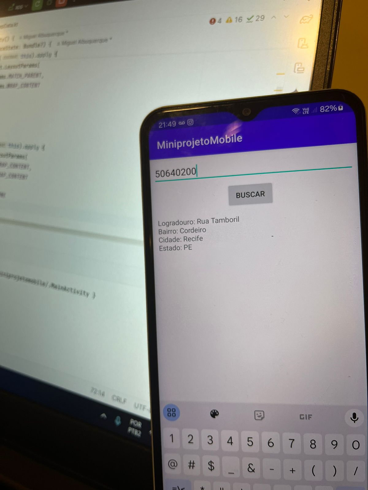

# **Busca CEP - Projeto Android**

## 🚀 Descrição

Este projeto consiste em um **aplicativo Android** que permite ao usuário realizar a busca de informações de um CEP (Código de Endereçamento Postal) diretamente no serviço **ViaCEP**.

---

## 🖼️ Prints do Aplicativo

### Tela de Busca de CEP

### Resultado da Busca

---

## 🎯 Funcionalidades

- **Busca de CEP**: O usuário insere um CEP e o aplicativo faz uma consulta no serviço **ViaCEP** para obter dados como logradouro, bairro, cidade e estado.
- **Armazenamento local**: As informações obtidas são salvas no banco de dados **SQLite** para futuras consultas.
- **Exportação de dados**: Os dados salvos no banco podem ser exportados para um arquivo **CSV**, facilitando a visualização e permitindo que os dados sejam compartilhados com outros aplicativos.
- **Interface simples**: Interface de usuário fácil de usar, com um campo de texto para entrada do CEP, um botão de busca e uma área para exibição do resultado.
